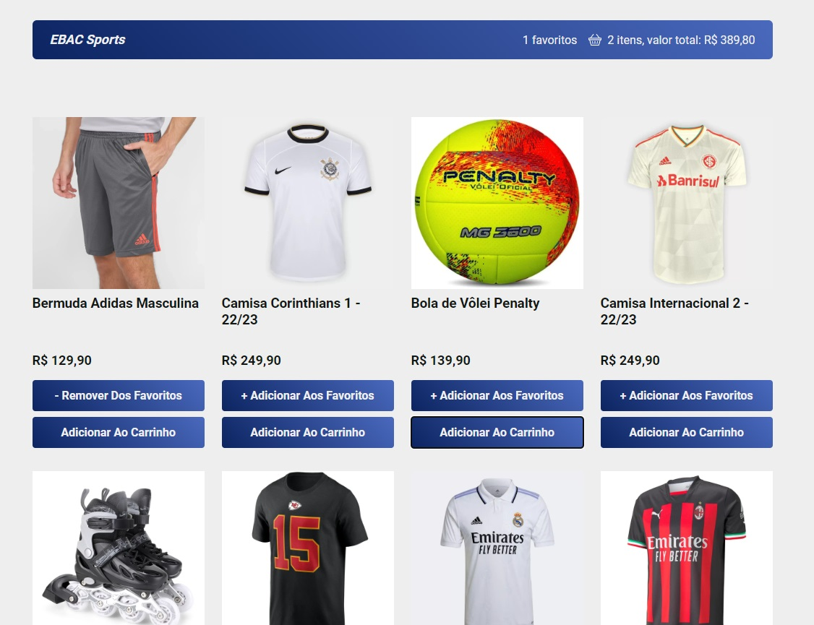

# 🏆 EBAC Sports


## ✔️ Tecnologias Utilizadas




<br>

## 🛠️ Como executar o projeto
Para executar este projeto localmente em sua máquina, siga estas etapas:

- Certifique-se de ter o Node.js instalado em sua máquina.

- Clone este repositório em sua máquina local usando o comando
```
git clone url_do_repositorio
```

- Navegue para dentro da pasta do projeto através do comando:
```
cd ebac_sports
```

- Instale as dependências do projeto executando o comando abaixo:
```
npm install
```

- Para Rodar o projeto após instalação execute o comando abaixo:
```
npm start
```

#### Opcional
- Execute o comando abaixo, caso ocorram erros com prettier, para que ele possaefetuar as modificações de forma instantânea.
```
npx prettier --write ./src/
```
